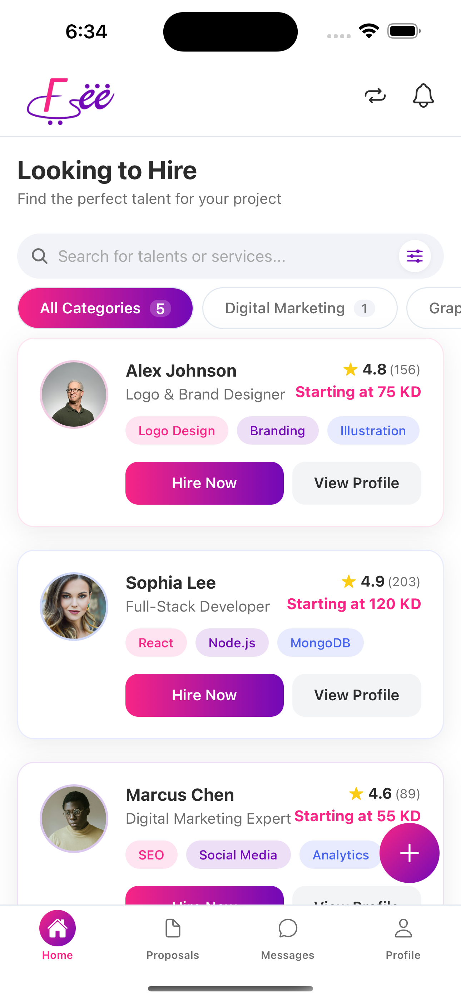
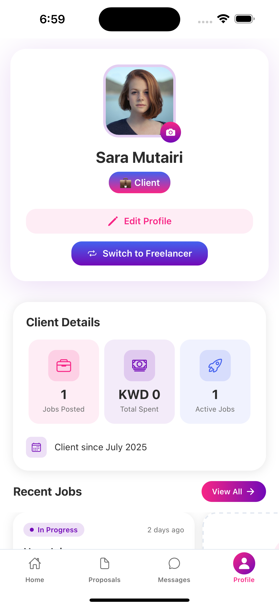
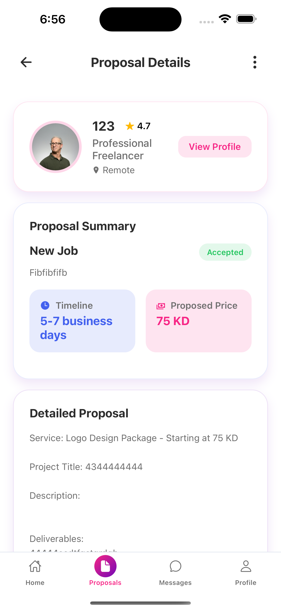

# 🚀 FeeShay - Freelance Marketplace Platform

<div align="center">
  
  
  **Find. Hire. Thrive.**
  
  [](https://reactnative.dev/)
  [](https://expo.dev/)
  [](https://nodejs.org/)
  [](https://mongodb.com/)
  [](https://typescriptlang.org/)
  [](https://socket.io/)
</div>

## 📋 Table of Contents

-   [About](#about)
-   [Features](#features)
-   [Tech Stack](#tech-stack)
-   [Prerequisites](#prerequisites)
-   [Installation](#installation)
-   [Configuration](#configuration)
-   [Running the Application](#running-the-application)
-   [API Documentation](#api-documentation)
-   [Deployment](#deployment)
-   [Project Structure](#project-structure)
-   [Contributing](#contributing)
-   [Screenshots](#screenshots)
-   [License](#license)

## 🎯 About

FeeShay is a modern, full-stack freelance marketplace platform that connects talented freelancers with clients looking for quality services. Built with React Native for
mobile-first experience and a robust Node.js backend, FeeShay provides a seamless platform for:

-   **Freelancers**: Showcase skills, find projects, submit proposals, and build professional relationships
-   **Clients**: Post jobs, browse talent, manage projects, and hire the best freelancers

## ✨ Features

### 🔐 Authentication & Authorization

-   JWT-based secure authentication
-   Dual role system (Freelancer/Client)
-   Social login integration (Google, Apple)
-   Role switching capabilities
-   Secure token management

### 👥 User Management

-   Comprehensive user profiles
-   Portfolio showcases
-   Skills and expertise tracking
-   Location and availability settings
-   Professional verification system

### 💼 Job Management

-   Job posting with detailed requirements
-   Category-based organization
-   Budget and timeline specifications
-   Skill-based job matching
-   Job status tracking (Open, In Progress, Completed)

### 📝 Proposal System

-   Detailed proposal submissions
-   Cover letter and pricing
-   Proposal status management
-   Client review and decision workflow
-   Real-time proposal notifications

### 💬 Real-time Messaging

-   Socket.io powered chat system
-   One-on-one conversations
-   Message history and persistence
-   Online status indicators
-   Typing indicators

### ⭐ Reviews & Ratings

-   5-star rating system
-   Detailed review comments
-   Review moderation
-   Average rating calculations
-   Review-based recommendations

### 📱 Mobile-First Design

-   Beautiful, intuitive UI/UX
-   Smooth animations and transitions
-   Pull-to-refresh functionality
-   Loading states and error handling
-   Responsive design patterns

### 🔔 Smart Notifications

-   Real-time push notifications
-   In-app notification center
-   Email notification preferences
-   Notification categorization
-   Read/unread status tracking

## 🛠 Tech Stack

### Frontend (Mobile App)

-   **Framework**: React Native 0.79.2
-   **Platform**: Expo ~53.0.9
-   **Language**: TypeScript 5.8.3
-   **State Management**: React Query (TanStack Query)
-   **Navigation**: Expo Router
-   **UI Components**: Custom components with Expo Vector Icons
-   **HTTP Client**: Axios
-   **Real-time**: Socket.io Client
-   **Storage**: Expo SecureStore & AsyncStorage
-   **Styling**: React Native StyleSheet with Linear Gradients

### Backend (API Server)

-   **Runtime**: Node.js
-   **Framework**: Express.js 5.1.0
-   **Language**: TypeScript 5.8.3
-   **Database**: MongoDB with Mongoose 8.16.1
-   **Authentication**: JWT (jsonwebtoken)
-   **Password Hashing**: bcrypt
-   **Real-time**: Socket.io 4.8.1
-   **File Upload**: Multer
-   **Validation**: Express Validator
-   **Logging**: Morgan
-   **CORS**: CORS middleware

### Database

-   **Primary**: MongoDB
-   **ODM**: Mongoose
-   **Models**: User, Job, Proposal, Message, Review, Category

## 📋 Prerequisites

Before you begin, ensure you have the following installed:

-   **Node.js** (v16 or higher) - [Download](https://nodejs.org/)
-   **npm** (v7 or higher) or **yarn** (v1.22 or higher)
-   **MongoDB** (v4.4 or higher) - [Installation Guide](https://docs.mongodb.com/manual/installation/)
-   **Expo CLI** - Install globally: `npm install -g @expo/cli`
-   **Android Studio** (for Android development) - [Download](https://developer.android.com/studio)
-   **Xcode** (for iOS development on macOS) - [Download](https://developer.apple.com/xcode/)

### System Requirements

-   **iOS**: iOS 11.0+ (iPhone 6s or newer)
-   **Android**: Android 6.0+ (API level 23)
-   **Memory**: 4GB RAM minimum, 8GB recommended
-   **Storage**: 10GB free space for development tools

## 🚀 Installation

### 1. Clone the Repository

```bash
git clone https://github.com/yourusername/feeshay.git
cd feeshay
```

### 2. Install Dependencies

#### Backend Setup

```bash
cd FeeShay/Backend
npm install
```

#### Frontend Setup

```bash
cd ../Frontend
npm install
```

## ⚙️ Configuration

### Backend Configuration

1. **Create Environment File**

    ```bash
    cd FeeShay/Backend
    cp .env.example .env  # Or create manually
    ```

2. **Configure Environment Variables** (`.env`)

    ```env
    # Database Configuration
    MONGODB_URI=mongodb://localhost:27017/feeshay
    MONGODB_URI_PROD=mongodb://your-production-db-url

    # JWT Configuration
    JWT_SECRET=your-super-secret-jwt-key-min-32-chars
    JWT_EXPIRES_IN=7d

    # Server Configuration
    PORT=3000
    NODE_ENV=development

    # File Upload Configuration
    MAX_FILE_SIZE=5242880
    UPLOAD_PATH=uploads

    # CORS Configuration
    CORS_ORIGIN=http://localhost:19006

    # Socket.io Configuration
    SOCKET_CORS_ORIGIN=http://localhost:19006

    # Optional: AI Integration
    OPENAI_API_KEY=your-openai-api-key
    GOOGLE_TRANSLATE_API_KEY=your-google-translate-api-key
    ```

3. **Database Setup**

    ```bash
    # Start MongoDB service
    brew services start mongodb/brew/mongodb-community  # macOS
    sudo systemctl start mongod                          # Linux

    # Run database setup script
    npm run setup

    # Optional: Seed with sample data
    npm run seed
    ```

### Frontend Configuration

1. **Configure API URL**

    ```bash
    cd FeeShay/Frontend
    ```

    Create or update `.env`:

    ```env
    EXPO_PUBLIC_API_URL=http://localhost:3000/api/v1
    ```

2. **Update App Configuration** (`app.json`)
    ```json
    {
        "expo": {
            "name": "FeeShay",
            "slug": "feeshay",
            "version": "1.0.0",
            "orientation": "portrait",
            "scheme": "feeshay"
        }
    }
    ```

## 🏃‍♂️ Running the Application

### Development Mode

1. **Start the Backend Server**

    ```bash
    cd FeeShay/Backend
    npm start
    ```

    Server will start on `http://localhost:3000`

2. **Start the Frontend (in a new terminal)**

    ```bash
    cd FeeShay/Frontend
    npm start
    ```

3. **Launch on Device/Simulator**
    - **iOS Simulator**: Press `i` in the Expo CLI
    - **Android Emulator**: Press `a` in the Expo CLI
    - **Physical Device**: Scan QR code with Expo Go app

### Production Build

#### Backend Production

```bash
cd FeeShay/Backend
npm run build
npm run start:prod
```

#### Frontend Production Build

```bash
cd FeeShay/Frontend

# Build for iOS
npx expo build:ios

# Build for Android
npx expo build:android

# Or use EAS Build (Recommended)
npx eas build --platform all
```

## 📚 API Documentation

### Base URL

```
Development: http://localhost:3000/api/v1
Production: https://your-domain.com/api/v1
```

### Authentication Endpoints

| Method | Endpoint            | Description         |
| ------ | ------------------- | ------------------- |
| POST   | `/auth/register`    | User registration   |
| POST   | `/auth/login`       | User login          |
| GET    | `/auth/profile`     | Get user profile    |
| PUT    | `/auth/profile`     | Update user profile |
| POST   | `/auth/switch-role` | Switch user role    |

### Job Endpoints

| Method | Endpoint    | Description    |
| ------ | ----------- | -------------- |
| GET    | `/jobs`     | Get all jobs   |
| POST   | `/jobs`     | Create new job |
| GET    | `/jobs/:id` | Get job by ID  |
| PUT    | `/jobs/:id` | Update job     |
| DELETE | `/jobs/:id` | Delete job     |

### Proposal Endpoints

| Method | Endpoint         | Description        |
| ------ | ---------------- | ------------------ |
| GET    | `/proposals`     | Get all proposals  |
| POST   | `/proposals`     | Submit proposal    |
| GET    | `/proposals/:id` | Get proposal by ID |
| PUT    | `/proposals/:id` | Update proposal    |
| DELETE | `/proposals/:id` | Delete proposal    |

For complete API documentation, see [API_ENDPOINTS.md](Backend/API_ENDPOINTS.md)

## 🚀 Deployment

### Backend Deployment

#### Option 1: Heroku

```bash
# Install Heroku CLI
# Create Heroku app
heroku create feeshay-backend

# Set environment variables
heroku config:set NODE_ENV=production
heroku config:set MONGODB_URI=your-mongodb-atlas-url
heroku config:set JWT_SECRET=your-production-jwt-secret

# Deploy
git subtree push --prefix=FeeShay/Backend heroku main
```

#### Option 2: DigitalOcean/AWS/GCP

```bash
# Build the application
npm run build

# Use PM2 for process management
npm install -g pm2
pm2 start dist/server.js --name "feeshay-backend"

# Setup nginx reverse proxy
# Configure domain and SSL certificates
```

#### Option 3: Docker

```dockerfile
# Dockerfile
FROM node:18-alpine

WORKDIR /app
COPY package*.json ./
RUN npm ci --only=production

COPY . .
RUN npm run build

EXPOSE 3000
CMD ["npm", "start"]
```

### Frontend Deployment

#### Option 1: Expo Application Services (EAS)

```bash
# Install EAS CLI
npm install -g @expo/eas-cli

# Configure EAS
eas build:configure

# Build for app stores
eas build --platform all

# Submit to stores
eas submit --platform all
```

#### Option 2: Web Deployment

```bash
# Build for web
npx expo export:web

# Deploy to Netlify/Vercel
# Upload dist folder to hosting service
```

### Database Deployment

#### MongoDB Atlas (Recommended)

1. Create account at [MongoDB Atlas](https://cloud.mongodb.com/)
2. Create new cluster
3. Configure network access
4. Create database user
5. Get connection string
6. Update `MONGODB_URI` in environment variables

## 📁 Project Structure

```
FeeShay/
├── Frontend/                     # React Native Mobile App
│   ├── app/                     # Expo Router Pages
│   │   ├── (auth)/             # Authentication Flow
│   │   │   ├── Onboarding.tsx
│   │   │   ├── Welcome.tsx
│   │   │   ├── Login.tsx
│   │   │   └── Register.tsx
│   │   └── (protected)/        # Authenticated Routes
│   │       └── (tabs)/         # Tab Navigation
│   │           ├── (home)/     # Home & Job Browsing
│   │           ├── (proposals)/ # Proposal Management
│   │           ├── (messages)/ # Real-time Messaging
│   │           └── (profile)/  # User Profile
│   ├── api/                    # API Service Layer
│   │   ├── auth.ts
│   │   ├── jobs.ts
│   │   ├── proposals.ts
│   │   └── messages.ts
│   ├── components/             # Reusable UI Components
│   │   ├── Home/
│   │   ├── Profile/
│   │   ├── Proposals/
│   │   └── Messages/
│   ├── constants/              # App Constants
│   ├── context/               # React Context
│   └── services/              # Business Logic
│
├── Backend/                    # Node.js API Server
│   ├── src/
│   │   ├── controllers/       # Route Controllers
│   │   │   ├── authController.ts
│   │   │   ├── jobController.ts
│   │   │   ├── proposalController.ts
│   │   │   └── messageController.ts
│   │   ├── models/           # Mongoose Models
│   │   │   ├── User.ts
│   │   │   └── Job.ts
│   │   ├── routes/           # API Routes
│   │   ├── middlewares/      # Express Middlewares
│   │   ├── services/         # Business Services
│   │   └── config/           # Configuration
│   ├── scripts/              # Database Scripts
│   └── tests/                # API Tests
│
└── README.md                 # This file
```

## 🧪 Testing

### Backend Testing

```bash
cd FeeShay/Backend

# Run all tests
npm test

# Run tests with coverage
npm run test:coverage

# Run API endpoint tests
npm run test:api
```

### Frontend Testing

```bash
cd FeeShay/Frontend

# Run tests (when implemented)
npm test

# Run linting
npm run lint
```

## 🤝 Contributing

We welcome contributions! Please follow these steps:

1. **Fork the Repository**
2. **Create Feature Branch**: `git checkout -b feature/amazing-feature`
3. **Commit Changes**: `git commit -m 'Add amazing feature'`
4. **Push to Branch**: `git push origin feature/amazing-feature`
5. **Open Pull Request**

### Development Guidelines

-   Follow TypeScript best practices
-   Write meaningful commit messages
-   Add tests for new features
-   Update documentation as needed
-   Follow existing code style

## 📱 Screenshots

<div align="center">
  
  
  
  
</div>

## 🔧 Troubleshooting

### Common Issues

#### Backend Issues

-   **MongoDB Connection Error**: Ensure MongoDB is running and connection string is correct
-   **JWT Secret Error**: Set a strong JWT_SECRET in environment variables
-   **Port Already in Use**: Change PORT in .env or stop conflicting process

#### Frontend Issues

-   **Metro Bundle Error**: Clear cache with `npx expo start --clear`
-   **iOS Build Issues**: Ensure Xcode is updated and iOS Simulator is available
-   **Android Build Issues**: Check Android SDK installation and emulator setup

#### API Connection Issues

-   **Network Error**: Check if backend server is running
-   **CORS Error**: Verify CORS_ORIGIN setting in backend
-   **Authentication Error**: Clear app data and login again

### Performance Optimization

-   Use React Query for efficient data caching
-   Implement image optimization and lazy loading
-   Monitor bundle size and optimize imports
-   Use FlatList for large data sets

## 📄 License

This project is licensed under the MIT License - see the [LICENSE](LICENSE) file for details.

## 🙏 Acknowledgments

-   [Expo](https://expo.dev/) for the amazing development platform
-   [React Native](https://reactnative.dev/) for cross-platform mobile development
-   [MongoDB](https://mongodb.com/) for the robust database solution
-   [Socket.io](https://socket.io/) for real-time communication

## 📞 Support

-   **Documentation**: [Wiki](https://github.com/yourusername/feeshay/wiki)
-   **Issues**: [GitHub Issues](https://github.com/yourusername/feeshay/issues)
-   **Email**: support@feeshay.com
-   **Discord**: [Join our Discord](https://discord.gg/feeshay)

---

### Developers

-   Ali Al Shammari
-   Haider Kamal
-   Mohammad Al Osaimi
-   Saad Abdul Hamid Parkar

<div align="center">
  <strong>Built with ❤️ by the FeeShay Team</strong>
  
  [Website](https://feeshay.com) • [Twitter](https://twitter.com/feeshay) • [LinkedIn](https://linkedin.com/company/feeshay)
</div>
